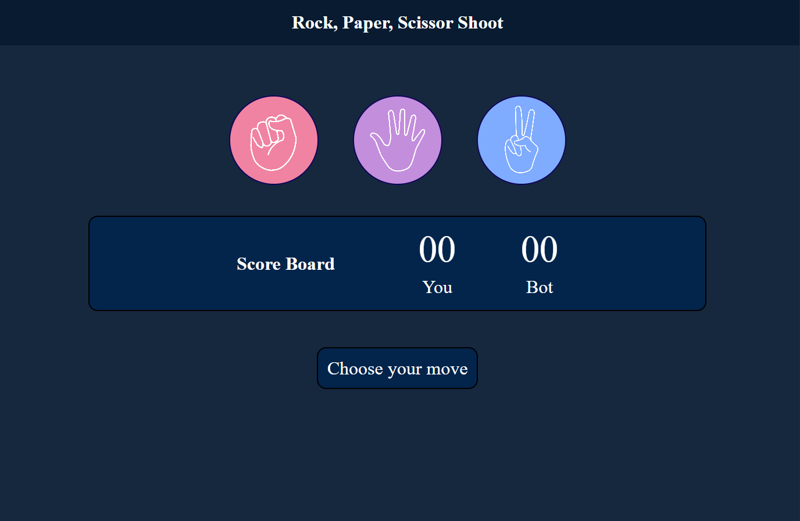

# 🎮 Rock, Paper, Scissors (Shoot!)

A simple yet fun **Rock, Paper, Scissors** mini-game built with **HTML, CSS, and JavaScript**.  
Challenge the computer, keep score, and enjoy smooth UI animations — all in a single-page app.

🌐 Live Demo: [Play Here](https://rock-paper-scissors-shoot-69.netlify.app/)

---

## 📸 Preview



---

## ✨ Features

- 🖱️ Click on Rock, Paper, or Scissors to play.
- 🤖 Random bot opponent with fair choice generation.
- 📊 Live scoreboard (tracks player vs. bot score).
- 🎨 Styled with modern CSS for a clean, responsive UI.
- 📝 Interactive messages showing win/lose/draw status.

---

## 🛠️ Tech Stack

- **HTML5** – Markup structure.
- **CSS3** – Styling and responsive design.
- **JavaScript (Vanilla JS)** – Game logic and interactivity.

---

## 📂 Project Structure

```bash
.
├── index.html        # Main game page
├── style.css         # Styling for layout & design
├── script.js         # Game logic
├── /image            # Assets (rock.png, paper.png, scissors.png)
└── README.md         # Documentation


📖 How to Play

Choose Rock, Paper, or Scissors by clicking the icon.

The bot automatically selects a random move.

The result (Win / Lose / Draw) is displayed with styled feedback.

Scoreboard updates automatically after every round.

🔮 Possible Improvements (Future Enhancements)

✅ Adding a Reset Game button.

✅ Dark/Light mode toggle.

✅ Multiplayer (player vs. player) support.

✅ Track win history in localStorage.
```
